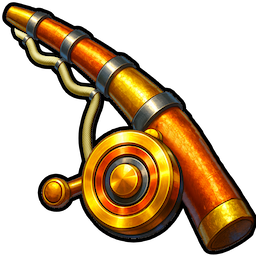

# Custom Fishing Cursor

A lightweight mod for **GONE Fishing** that replaces the default system cursor with a custom cursor that looks like a fishing rod.

## 🛠 Installation

This mod require **UE4SS (Unreal Engine 4 Scripting System)** to function.

1.  Download the latest experimental version of [UE4SS from GitHub](https://github.com/UE4SS-RE/RE-UE4SS/releases/tag/experimental-latest).
2.  Install **UE4SS** into your game binaries folder (both ue4ss folder and the dll from the zip).
3.  Place the contents of this mod from this repository into the following directory:
    `GONEfishing.exe/GONEfishing/Binaries/Win64/ue4ss/Mods/CustomFishingCursor`

## ⚙️ Under the Hood

This mod was built using C++ and hooks into the winapi UI layer to override the cursor the game sets. The project includes `.pdn` source files for easy editing in Paint.NET.